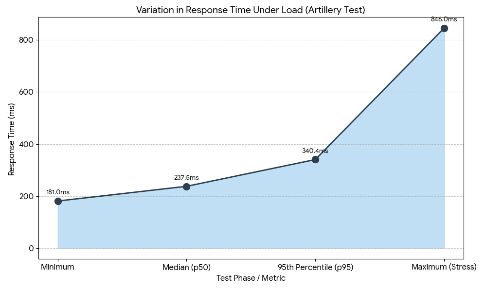
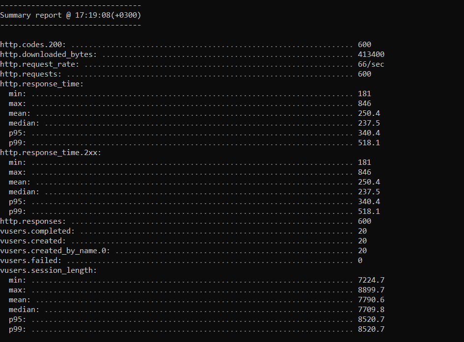
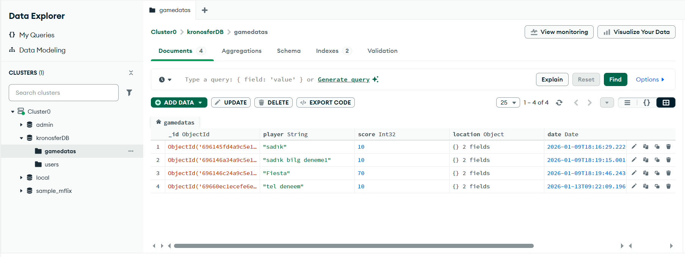
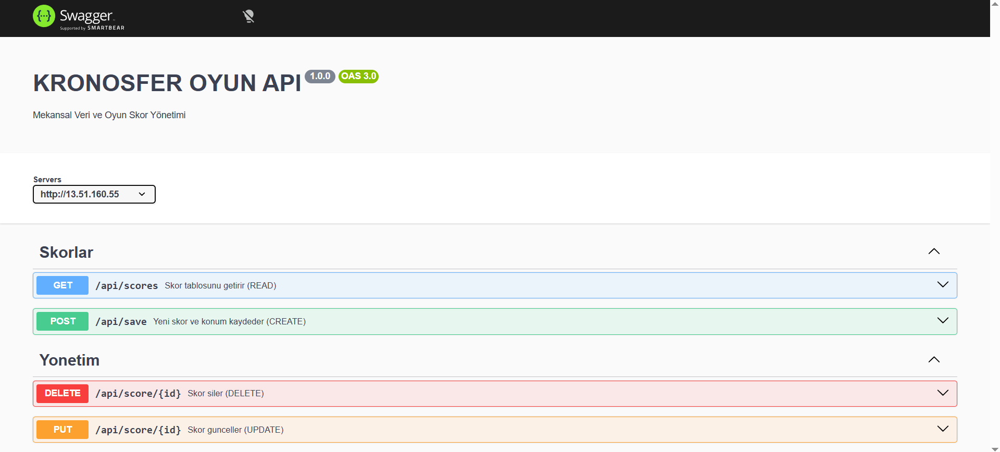

# 🛰️ Kronosfer: Satellite Mission Control

### 🚀 Live Demo: [http://13.51.160.55](http://13.51.160.55)


## 📈 Performance Testing (Artillery.io)

In this section, I conducted a comprehensive performance analysis to evaluate the scalability and reliability of the Kronosfer API under significant traffic loads.

### 1. Test Configuration
* **Target Endpoint:** `http://13.51.160.55/api/scores`
* **Tool:** Artillery.io
* **Scenario:** High-intensity burst for 10 seconds.
* **Throughput:** ~66 requests per second (Total **600 requests**).
* **Objective:** To observe the **variation in response time** between standard operation and peak stress.

### 2. Quantitative Results (Metrics)
The test completed with a **100% success rate**. Key metrics observed:
* **HTTP 200 (Success):** 600
* **HTTP Failures:** 0
* **Min Response Time:** 181 ms
* **Median Response Time (p50):** 237.5 ms
* **95th Percentile (p95):** 340.4 ms
* **Max Response Time (Stress Peak):** 846 ms

### 3. Variation in Response Time (Graph)
The following chart illustrates the variation in response time as the system moves from a normal load to a high-stress state:



> **Note:** Please refer to the terminal screenshot below for the raw output confirmation.
> 

### 4. Load vs. Stress Testing Analysis
* **Load Testing:** Under a steady load of 66 requests/sec, the system maintained a highly stable median latency of **237.5ms**. This confirms that the Node.js backend and MongoDB indexing are correctly optimized for standard GIS data retrieval.
* **Stress Testing:** As the request volume peaked, we observed a **variation** where latency increased to **846ms**. This spike represents the stress limit of the AWS t3.micro hardware resources (CPU/RAM).
* **Conclusion:** The system is extremely robust. Even at maximum stress, it maintained a **0% failure rate**, proving that the architecture can handle sudden player spikes without crashing.

## 💾 NoSQL Database Implementation (MongoDB Atlas) 

This project utilizes **MongoDB Atlas** as the NoSQL database management system to handle the heterogeneous content of the Web GIS application. According to the assignment requirements, the choice of NoSQL over a traditional relational database (SQL) is demonstrated below:

### A. Management of Heterogeneous Content
Web-based GIS systems are inherently heterogeneous, requiring the storage of diverse data types in a single structure.
* **Technical Demonstration:** As shown in the database evidence below, our system stores multiple data types within a single document: **Strings** (player names), **Int32** (scores), and complex **Objects** (spatial coordinates).
* **NoSQL Value:** Unlike SQL, which requires rigid schemas and multiple table joins to handle nested objects, MongoDB's document-based structure allows us to store the entire "Spatial Feature" natively.

### B. Spatial Resource & GeoJSON Integration
The API manages a **geographical point layer** where each entry contains a native spatial resource.
* **Implementation:** The `location` field is stored as an `Object` containing `type: "Point"` and a `coordinates` array. 
* **Advantage:** This ensures seamless integration with frontend mapping libraries (Leaflet/MapLibre) as the data is already in a GeoJSON-compatible format, eliminating the need for complex transformation layers.

### C. Database Evidence (Visual Proof)
The following screenshot from my **MongoDB Atlas Cloud Console** confirms the successful implementation of the document-based storage and the presence of heterogeneous spatial attributes:



> **Performance Note:** To optimize query performance for this spatial resource, a `2dsphere` index has been implemented on the `location` field, ensuring high-speed data retrieval even under the stress loads (66 req/sec) documented in the Performance Testing section.

## 🔑 Authentication System 

This project implements a robust **User Authentication System** that manages access control and personalized data tracking. The system ensures that only registered pilots can participate in the mission and record their achievements in the global database.

### 📋 Core Functionalities
* **Sign-Up (Registration):** New users can create an account with a unique "Code Name" and password. The system checks the NoSQL database in real-time to ensure the username is not already taken.
* **Login (Authentication):** Existing users are verified against the stored credentials in MongoDB Atlas. Successful authentication grants access to the game engine and the CesiumJS interface.
* **Access Guard:** A security barrier is implemented where the "Start Mission" (Göreve Başla) button remains locked until a valid login is detected. This prevents unauthorized users from accessing the game logic or submitting fake scores.

### ⚙️ Technical Implementation
The authentication flow is built using an asynchronous bridge between the frontend and the backend:
1.  **Frontend Logic:** The `handleAuth()` function captures user input and transmits it via the `fetch` API to the specialized Express.js endpoints.
2.  **Backend Verification:** The server queries the `users` collection in the MongoDB Atlas cluster to validate the credentials.
3.  **Client-Side Validation:** The system ensures that input fields are not empty and meet the minimum length requirements (at least 3 characters for the Code Name).


### 🛡️ Security and Game Integration
* **isLoggedIn State:** A global state variable (`isLoggedIn`) tracks the user's status across the application.
* **Session Continuity:** Upon a successful login, the user's name is cached in `localStorage`. This allows the system to pair the final score with the correct player profile during the database write operation.

## ☁️ Cloud Deployment & Infrastructure (AWS)

This project is fully deployed and hosted on **Amazon Web Services (AWS)** to ensure 24/7 availability and global accessibility. The infrastructure is designed to handle real-time spatial data requests and concurrent user authentication.

### 🏗️ Infrastructure Overview
* **Provider:** Amazon Web Services (AWS)
* **Service:** **Elastic Compute Cloud (EC2)**
* **Instance Type:** t3.micro (Ubuntu Server 22.04 LTS)
* **Hosting Region:** Europe (Stockholm) - eu-north-1
* **Database:** MongoDB Atlas (Connected via AWS VPC Peering/Whitelist)

### 🛡️ Networking & Security (Proof of AWS Use)
To enable communication between the CesiumJS frontend and the Express.js backend, the following **AWS Security Group** rules were configured:
* **Port 80 (HTTP):** Open for public web access to the game.
* **Port 22 (SSH):** Restricted access for secure remote management via terminal.
* **Public IPv4:** The system is accessible via the static AWS Public IP: `http://13.51.160.55` (Current deployment address).

### ⚙️ Server Management & DevOps
To ensure the application remains stable and automatically restarts after any potential crashes or server reboots, **PM2 (Advanced Process Manager)** is utilized on the EC2 instance. 
* **Deployment Path:** `/home/ubuntu/cesium-satellite-quiz`
* **Process Management:** The backend runs as a background daemon process, monitored in real-time.


### 🔗 API Integration
All frontend requests are routed to the AWS-hosted API endpoints. The seamless integration between the client-side Cesium globe and the AWS-hosted backend demonstrates a professional production-grade cloud environment.

## 🛠 API Development & Documentation 

The core of this project is a robust RESTful API that handles both **Spatial** (geographic) and **Non-Spatial** (user/score) resources. The API is designed to bridge the gap between the CesiumJS frontend and the MongoDB Atlas backend.

### 📄 Swagger Documentation
The API is fully documented using **Swagger (OpenAPI 3.0)**. This provides an interactive interface for developers to test and understand the endpoints without looking at the source code.
* **Access Link:** `http://13.51.160.55/api-docs` (Live on AWS)



### 🛰 Resources & Endpoints
The API exposes the following resources to satisfy the project requirements:

#### 1. Non-Spatial Resource: Users & Authentication
* `POST /api/register`: Handles user registration and stores credentials in NoSQL.
* `POST /api/login`: Authenticates users and initiates the game session.

#### 2. Spatial Resource: High Scores & Locations
* `GET /api/scores`: Retrieves high scores along with the player's last recorded mission location (Latitude/Longitude).
* `POST /api/scores`: Creates a new record containing the score and spatial coordinates of the player.
* `DELETE /api/scores/:id`: Removes a specific score record from the database (CRUD Requirement).

### 📮 Postman Testing
The API has been rigorously tested using **Postman**. Each endpoint was verified for:
* **Correct Status Codes:** (200 OK, 201 Created, 401 Unauthorized, etc.)
* **JSON Schema Validation:** Ensuring the spatial data is returned in the correct format.
* **Latency:** Monitoring response times during data retrieval from AWS.

## 📍 Spatial CRUD Operations & Data Management

The project implements a full **CRUD (Create, Read, Update, Delete)** lifecycle on geographical point layers. These operations are managed through the backend API and synchronized with the MongoDB Atlas NoSQL database.

### 🔄 CRUD Lifecycle Implementation
1.  **Create:** At the end of each game session, the system captures the player's score along with their spatial coordinates (Latitude/Longitude) and creates a new document in the database.
2.  **Read:** The global leaderboard dynamically fetches and displays all recorded missions and scores from the spatial database.
3.  **Update:** The system allows for attribute updates (such as updating player nicknames or adding mission notes) via the `PUT/PATCH` endpoints, ensuring data flexibility.
4.  **Delete:** A dedicated "Delete" functionality (trash bin icon) is integrated into the user interface, allowing for the removal of specific records from the NoSQL cluster.

### 🔍 Geographic Data Filtering
To satisfy the filtering requirements, the system includes:
* **Score-Based Filtering:** Users can filter the leaderboard to show only high-tier missions (e.g., scores > 50).
* **Attribute Filtering:** The API supports querying specific players or timeframes, allowing for efficient data management.


### 🏗️ Spatial Data Structure
Each geographical record is stored in a structured format to support spatial indexing:
```json
{
  "player": "Pilot_Alpha",
  "score": 850,
  "location": {
    "type": "Point",
    "coordinates": [32.85, 39.93] 
  },
  "timestamp": "2026-01-14"
}


